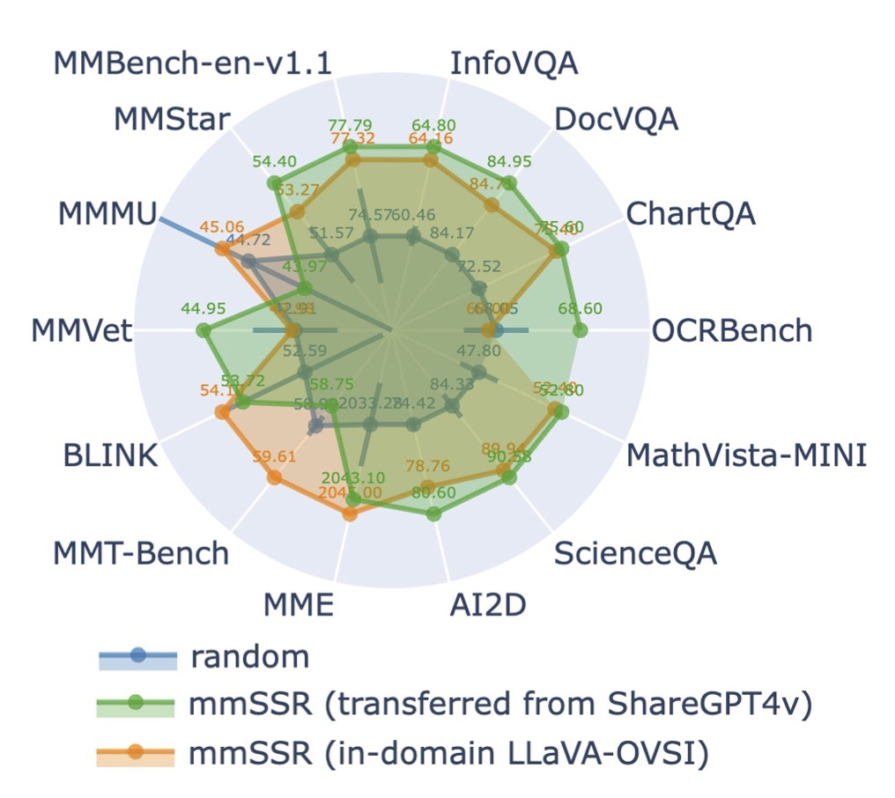

<h1 align="center">
  
  <br />
  mmSSR
</h1>


<p align="center">
<a href="https://arxiv.org/abs/2503.13383">
    <strong>Harvesting Rich, Scalable and Transferable Multi-Modal Data for Instruction Fine-Tuning</strong>
  </a>
  <br>
    <span><a href="https://lyumengyao.github.io/">Mengyao Lyu</a><sup>1,2</sup>,
    </span>
    <span><a href="https://yanli.netlify.app/">Yan Li</a><sup>3</sup>,</span>
    <span>Huasong Zhong<sup>3</sup>,</span>
    <span>Wenhao Yang<sup>3</sup>,</span>
    <span>Hui Chen<sup>1,2</sup>,</span>
    <span><a href="https://jungonghan.github.io">Jungong Han</a><sup>1,2</sup>,</span>
    <span><a href="http://ise.thss.tsinghua.edu.cn/mig/dgg.html">Guiguang Ding</a><sup>1,2†</sup>,</span>
    <span>Zhenheng Yang<sup>3</sup></span><br>
    <span><sup>1</sup>Tsinghua University,</span>
    <span><sup>2</sup>BNRist,</span>
    <span><sup>3</sup>Bytedance</span>
  <br>
</p>
<p align="center">
  <a href="https://lyumengyao.github.io/projects/mmssr">
    
  </a>
  <a href="https://huggingface.co/collections/mengyaolyu/mmssr-67ee1b1868b15753b5a27253">
    
  </a>
  <a href="https://arxiv.org/abs/2503.13383">
    
  </a>
</p>

## 📝 TLNR
🌐 mmSSR, as stated in the title, harvests **rich, scalable and transferable** multi-modal data for supervised fine-tuning

📊 Specifically, we redefine the granularity of data valuation by decomposing <em>quality</em> into **14 VL capabilities** and formulating <em>diversity</em> into **superficial interaction styles**, such that **m**ulti-**m**odal **r**ich **s**cores and **s**tyles (**mmSSR**) guarantee that high-scoring **fine-grained** information is efficiently conveyed to users in diversified forms.

👑 mmSSR is **data-scalable**: it is the first to scale to the 2.6M open data pool of LLaVA-OVSI, achieving **99.1% of full performance with only 30% of the data**.

🧩 mmSSR is **customizable** and **transferable**: towards your task requirements, it supports capability customization of our LLaVA-OVSI pre-trained models and direct generalization to your datapool for rich scoring and style classification.

<details>
<summary>VL capabilities currently supported by us (and available open data sources)</summary>

- object spatial understanding
- attribute identification
- logical deduction
- scene understanding
- fine-grained recognition
- language generation
- in-context learning
- comparative analysis
- activity recognition
- causal reasoning
- humanities
- stem knowledge
- data understanding
- optical character recognition

</details>

🔄 mmSSR is **capability-scalable**: For capability growth (e.g. in your specialized domains), it is promising to follow the mmSSR pipeline to curate a small set of scores, fine-tune a mmSSR, and then sample in rich scores and styles.

## 👑 Performance
<details>
<summary>👉 See the full table of <strong>mmSSR vs Competitors</strong></summary>

| | MMBench<sub>en-v1.1</sub> | MMStar | MMMU | MMVet | BLINK | MMT-Bench | MME | AI2D | ScienceQA | MathVista<sub>MINI</sub> | >Rand | /FULL |
|-|:-:|:-:|:-:|:-:|:-:|:-:|:-:|:-:|:-:|:-:|:-:|:-:|
| | | | | | | 5% | | | | | | |
 |  Random  |  73.74  |  47.98  |  <strong>43.70</strong>  |  42.34  |  50.61  |  58.87  |  <strong>2004.50</strong>  |  73.07  |  81.52  |  45.47  | - |  89.29 |
 |  PPL-mid  |  67.34  |  45.27  |  38.98  |  30.18  |  45.27  |  54.33  |  1887.71  |  66.74  |  74.76  |  31.40  | 0/10 |  78.31 |
 |  PPL-si  |  71.98  |  44.67  |  38.48  |  35.14  |  <strong><u>54.10</u></strong>  |  57.98  |  1856.79  |  67.84  |  78.24  |  36.50  | 1/10 |  83.10 |
 |  Deita  |  72.91  |  47.47  |  41.28  |  40.23  |  <u>52.59</u>  |  56.57  |  1956.50  |  70.76  |  79.57  |  36.10  | 1/10 |  85.79 |
 |  CLIP  |  <u>74.23</u>  |  47.27  |  40.08  |  35.73  |  <u>52.96</u>  |  56.73  |  1902.65  |  <u>73.61</u>  |  78.63  |  39.80  | 3/10 |  85.41 |
 |  E5-V  |  70.90  |  43.00  |  38.78  |  38.44  |  49.94  |  54.65  |  1810.47  |  66.58  |  77.54  |  37.40  | 0/10 |  81.87 |
 |  COINCIDE  |  72.76  |  <u>48.33</u>  |  43.17  |  <strong><u>45.60</u></strong>  |  49.43  |  57.53  |  1852.66  |  <u>73.15</u>  |  79.62  |  45.40  | 3/10 |  88.45 |
 |  ICONS  |  66.72  |  <u>52.20</u>  |  41.18  |  38.03  |  47.92  |  55.96  |  1811.13  |  <u>76.20</u>  |  <u>83.64</u>  |  <u>46.90</u>  | 4/10 |  86.64 |
 |  mmSSR  |  <strong><u>77.79</u></strong>  |  <strong><u>53.33</u></strong>  |  43.27  |  <u>43.53</u>  |  <u>51.83</u>  |  <strong><u>59.16</u></strong>  |  1938.68  |  <strong><u>77.66</u></strong>  |  <strong><u>88.45</u></strong>  |  <strong><u>52.00</u></strong>  | 8/10 |  <strong><u>93.20</u></strong> |
| | | | | | | 10% | | | | | | |
 |  Random  |  74.57  |  51.57  |  44.72  |  42.91  |  52.59  |  58.99  |  2033.28  |  74.42  |  84.33  |  47.80  | - |  91.70 |
 |  PPL-mid  |  63.54  |  46.87  |  39.08  |  36.93  |  45.90  |  54.30  |  1831.03  |  67.23  |  73.87  |  39.50  | 0/10 |  80.72 |
 |  PPL-si  |  <u>74.69</u>  |  49.80  |  41.28  |  40.60  |  <u>53.09</u>  |  57.95  |  1841.11  |  <u>75.16</u>  |  80.71  |  40.40  | 3/10 |  87.63 |
 |  Deita  |  <u>75.39</u>  |  48.80  |  43.77  |  42.25  |  <strong><u>54.48</u></strong>  |  57.40  |  1996.34  |  71.60  |  78.33  |  40.80  | 2/10 |  88.72 |
 |  CLIP  |  <u>75.23</u>  |  49.87  |  40.38  |  37.16  |  <u>53.59</u>  |  <u>59.35</u>  |  1921.04  |  <u>76.62</u>  |  80.07  |  41.00  | 4/10 |  87.69 |
 |  E5-V  |  70.51  |  45.13  |  38.78  |  39.59  |  50.57  |  55.10  |  1787.94  |  68.94  |  77.54  |  37.20  | 0/10 |  82.76 |
 |  COINCIDE  |  <u>75.23</u>  |  49.73  |  <u>44.77</u>  |  42.52  |  50.69  |  58.71  |  2027.58  |  <u>74.77</u>  |  82.05  |  47.00  | 3/10 |  90.66 |
 |  ICONS  |  71.67  |  <strong><u>53.33</u></strong>  |  44.17  |  40.46  |  49.18  |  57.40  |  1789.60  |  <u>76.65</u>  |  <u>85.23</u>  |  <u>51.10</u>  | 4/10 |  89.91 |
 |  mmSSR  |  <strong><u>77.32</u></strong>  |  <u>53.27</u>  |  <strong><u>45.06</u></strong>  |  <strong><u>42.98</u></strong>  |  <u>54.10</u>  |  <strong><u>59.61</u></strong>  |  <strong><u>2045.00</u></strong>  |  <strong><u>78.76</u></strong>  |  <strong><u>89.94</u></strong>  |  <strong><u>52.40</u></strong>  | 10/10 |  <strong><u>94.75</u></strong> |
| | | | | | | 30% | | | | | | |
 |  Random  |  78.25  |  54.60  |  44.40  |  46.10  |  55.23  |  59.61  |  2092.60  |  78.28  |  88.32  |  52.57  | - |  95.82 |
 |  PPL-mid  |  73.99  |  <u>54.93</u>  |  43.97  |  41.01  |  53.09  |  58.78  |  2036.54  |  77.20  |  87.01  |  <u>56.40</u>  | 2/10 |  93.77 |
 |  PPL-si  |  72.52  |  48.33  |  42.57  |  43.62  |  51.83  |  55.07  |  1976.46  |  76.55  |  78.48  |  42.20  | 0/10 |  88.22 |
 |  Deita  |  76.93  |  54.13  |  43.67  |  44.04  |  55.11  |  <u>59.66</u>  |  2042.63  |  <u>79.50</u>  |  83.54  |  50.30  | 2/10 |  93.99 |
 |  CLIP  |  74.30  |  53.80  |  43.07  |  45.87  |  51.95  |  59.16  |  2039.14  |  <u>80.02</u>  |  83.99  |  48.80  | 1/10 |  93.07 |
 |  E5-V  |  74.30  |  46.07  |  43.27  |  <u>47.80</u>  |  50.32  |  57.85  |  1955.13  |  74.45  |  81.61  |  43.70  | 1/10 |  89.52 |
 |  COINCIDE  |  78.02  |  <u>55.47</u>  |  <strong><u>45.66</u></strong>  |  <u>46.24</u>  |  52.84  |  <u>59.80</u>  |  2047.37  |  <u>79.73</u>  |  84.33  |  <u>55.10</u>  | 6/10 |  95.82 |
 |  ICONS  |  71.90  |  53.40  |  43.87  |  42.25  |  50.32  |  59.23  |  1985.64  |  78.21  |  86.76  |  <u>54.10</u>  | 1/10 |  92.55 |
 |  mmSSR  |  <strong><u>79.57</u></strong>  |  <strong><u>57.53</u></strong>  |  <u>44.87</u>  |  <strong><u>48.49</u></strong>  |  <strong><u>56.24</u></strong>  |  <strong><u>59.83</u></strong>  |  <strong><u>2132.93</u></strong>  |  <strong><u>81.25</u></strong>  |  <strong><u>92.46</u></strong>  |  <strong><u>57.40</u></strong>  | 10/10 |  <strong><u>99.11</u></strong> |
| | | | | | | FULL | | | | | | |
| LLaVA<sub>OVSI</sub> | 80.57 | 59.40 | 45.16 | 47.16 | 56.87 | 60.73 | 2117.56 | 81.87 | 92.76 | 59.60 | - | 100 |

</details>

|  |
|:---------------------------------:|
| mmSSR vs Random Sampling (the strong baseline) | 

|  |  |
|:---------------------------------:|:---------------------------------:|
| Selected Subset Generalization | mmSSR Generalization |

## 💎 Usage

### Prepare Env and Dataset
#### **Clone the repository and install dependencies**
```bash
git clone https://github.com/lyumengyao/mmssr
cd mmssr

conda create -n mmssr python=3.10 -y
conda activate mmssr
pip install --upgrade pip  # Enable PEP 660 support.
pip install -e ".[train]"
pip install flash_attn --no-build-isolation

```
#### **Prepare the LLaVA-OVSI dataset**
Based on the intersection of [yaml file](https://github.com/LLaVA-VL/LLaVA-NeXT/blob/main/scripts/train/single_image.yaml), [upload script](https://github.com/LLaVA-VL/LLaVA-NeXT/blob/main/playground/upload_data.py) and [openly available subsets](https://huggingface.co/datasets/lmms-lab/LLaVA-OneVision-Data) of LLaVA-OVSI, organize images and question-answer json file as follows:
```
./datasets/LLaVA-OneVision-Data-SI/images
├── ai2d(cauldron,llava_format)
│   └── cauldron
│       └── ai2d
│           └── images
├── ai2d(gpt4v)
├── ai2d(internvl)
......
```
```json
  {
    "id": "9177_13",
    "image": "geo170k(qa)/9177_13.jpg",
    "conversations": [
      {
        "from": "human",
        "value": "<image>\nFirst perform reasoning, then finally select the question from the choices in the following format: Answer: xxx.\nQuestion: In the given diamond ABCD, let's denote the length of EF as variable y. If the length of CD is 8.0, what is the value of y?\nChoices:\nA: 4.0\nB: 12.0\nC: 8.0\nD: 4.0"
      },
      {
        "from": "gpt",
        "value": "To determine the value of y, we can use the fact that EF is parallel to BC and F is the midpoint of AC..."
      }
    ],
    "idx": 1769668
  }
```
to obtain a 2.6M data pool. During curation, create the `idx`, the unique identifier, for each item for sampling.

### Evaluate Data with Pre-trained mmSSR
#### **Prepare pre-trained mmSSR**
| Model | Pre-trained | Usage  |
|------------------------------------------------|-----------|------------|
| mmssr-7b-scorer                                    | [:hugs:](https://huggingface.co/mengyaolyu/mmssr-7b-scorer)          | sample capability rating [0, 5] |
| mmssr-7b-styler                                    | [:hugs:](https://huggingface.co/mengyaolyu/mmssr-7b-styler)          | sample style identification |
<details>
<summary>Usage and License Notices</summary>
This project utilizes certain datasets and checkpoints that are subject to their respective original licenses. Users must comply with all terms and conditions of these original licenses, including but not limited to the [OpenAI Terms of Use](https://openai.com/policies/terms-of-use) for the dataset and the specific licenses for base language models for checkpoints trained using the dataset (e.g. [Llama-1/2 community license](https://ai.meta.com/llama/license/) for LLaMA-2 and Vicuna-v1.5, [Tongyi Qianwen RESEARCH LICENSE AGREEMENT](https://huggingface.co/Qwen/Qwen1.5-0.5B-Chat/blob/main/LICENSE) and [Llama-3 Research License](https://llama.meta.com/llama3/license/)). This project does not impose any additional constraints beyond those stipulated in the original licenses. Furthermore, users are reminded to ensure that their use of the dataset and checkpoints is in compliance with all applicable laws and regulations.
</details>

#### **Obtain scores and styles**
```bash
bash mmssr_scripts/1_infer.sh
```

### Sample Data
```bash
bash mmssr_scripts/2_sample.sh 0.3
```
Then the selected subset can be used for faster SFT following `llava_scripts/finetune_si.sh`.

### (Optional) Tune Your Own mmSSR
```bash
bash mmssr_scripts/3_finetune.sh
```


## 📖 Citation
If you find mmSSR useful for your research or applications, please cite our paper:

```
@article{lyu2025mmssr,
  title={Cream of the Crop: Harvesting Rich, Scalable and Transferable Multi-Modal Data for Instruction Fine-Tuning},
  author={Lyu, Mengyao and Li, Yan and Zhong, Huasong and Yang, Wenhao and Chen, Hui and Han, Jungong and Ding, Guiguang and Yang, Zhenheng},
  journal={arXiv preprint arXiv:2503.13383},
  year={2025}
}
```

## Acknowledgement

- [LLaVA-Next](https://github.com/LLaVA-VL/LLaVA-NeXT)
